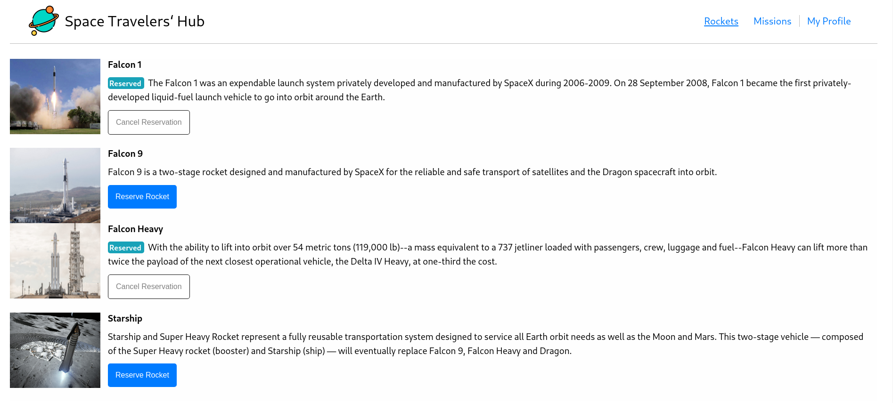
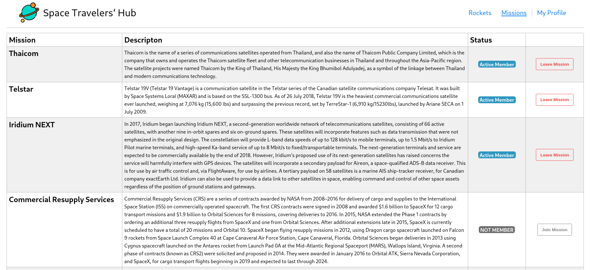
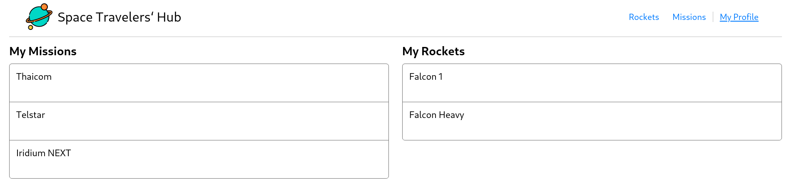

## space-hub

## About Project

"Space Traveler's Hub" is A web application that provides commercial and scientific space travelling services, We are working with real live data from the SpaceX API. The application will allow users to book rockets and join selected space missions.
The Space Travelers' Hub consists of Rockets, Missions, and the My Profile section.





## Built With

- React js
- Redux
- CSS
- Testing
- API

## Click here for live version

- live demo: [coming soon]()

## Getting Started

- Clone this repo <https://github.com/NickEmma/space-hub>

  ```bash
  git clone https://github.com/NickEmma/space-hub
  ```

- Navigate to SpaceTravelers folder/directory

  ```bash
  cd SpaceTravelers
  ```

- On the comandline, at the project's root, run `npm install` to install app dependencies

- Next, run `npm start` which will run the app in the development mode.

- Open [http://localhost:3000](http://localhost:3000) to view it in the browser.

- ALTERNATIVELY

  - Just run `npm run build` which will build the project and generate output files into the `build` directory.

  - Go to `build` directory and manually open `index.html` to interact with the app

## Authors

👤 **Abdollah Raafat**

- GitHub: [AbdollahRaafat](https://github.com/AbdollahRaafat)
- LinkedIn: [AbdollahRaafat](https://www.linkedin.com/in/abdollah-raafat-886059221/)
- Twitter: [AbdollahRaafat](https://twitter.com/abdollah_raafat)

👤 **Nick Emma**

- GitHub: [@NickEmma](https://github.com/NickEmma)
- Twitter: [@NickEmma](https://twitter.com/techieEmma)
- LinkedIn: [joel kalema](https://www.linkedin.com/in/nicholas-emmanuel-6b9775207/)

## 🤝 Contributing

Contributions, issues, and feature requests are welcome!
thanks:

## Show your support

Give a ⭐️ if you like this project!

## Acknowledgments

- Microverse
- [ReactJS Organization](https://reactjs.org/) for the amazing [Documentation](https://reactjs.org/docs/getting-started.html) on React.
- [Redux Organization](https://redux.js.org/) for the amazing [Redux Essentials Tutorial](https://redux.js.org/tutorials/essentials/part-1-overview-concepts) on React.

## 📝 License

This project is [MIT](./LICENSE) licensed.
